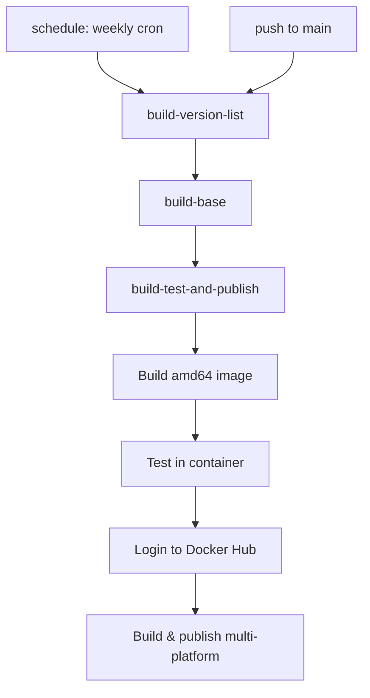

# agents.md — Project Guide for AI Agents

## Overview

This repository builds multi-platform Docker images of **nginx** compiled with the **Google ngx_brotli** module for Brotli compression. The base OS is **Alpine Linux 3.x**.

**Image name:** `fholzer/nginx-brotli`
**Target architectures:** `linux/amd64`, `linux/arm64`, `linux/ppc64le`

## Directory Structure

```
├── Dockerfile              # Multi-stage build definition
├── conf/
│   ├── nginx.conf          # Default nginx configuration (brotli enabled)
│   └── nginx.vh.default.conf  # Default virtual host config
├── ci/
│   ├── checkNginxVersions.py   # Checks GitHub for new nginx versions
│   ├── getPublishTags.py       # Determines Docker tags per nginx version
│   └── updateVersionsPr.py     # Creates/updates PR for missing versions
├── gpg/                    # GPG keys for nginx source verification
│   ├── arut.key
│   ├── nginx_signing.key
│   ├── pluknet.key
│   ├── sb.key
│   └── thresh.key
├── tests/
│   └── tests.sh            # Runs nginx-official test suite inside built image
├── versions.txt            # List of nginx versions to build
└── .github/workflows/
    ├── check-versions.yml    # Daily version check (cron)
    └── publish.yml           # CI/CD pipeline
```

## Key Files

### [`Dockerfile`](Dockerfile)

Multi-stage Docker build:

1. **`base`** — Alpine Linux with `apk upgrade`
2. **`builder-base`** — Build dependencies (gcc, openssl-dev, pcre-dev, zlib-dev, etc.) + brotli build deps (cmake, git, autoconf, libtool)
3. **`builder`** — Fetches nginx source, fetches ngx_brotli at pinned commit (`a71f9312c2deb28875acc7bacfdd5695a111aa53`), configures and compiles

**Build args:**

| Argument | Default | Description |
|---|---|---|
| `ALPINE_VERSION` | `latest` | Alpine base image tag |
| `NGINX_VERSION` | *(required)* | nginx version to build |
| `NGX_BROTLI_COMMIT` | `a71f9312c2deb28875acc7bacfdd5695a111aa53` | ngx_brotli git commit |
| `CONFIG` | *(long --configure string)* | nginx build configuration |

### [`versions.txt`](versions.txt)

Plain text file listing nginx versions to build, one per line. Example:

```
1.28.3
1.29.8
1.30.4
1.31.2
1.31.3
```

### [`ci/getPublishTags.py`](ci/getPublishTags.py)

Determines which Docker tags to assign to each nginx version. Tag rules:

- `v<X.Y.Z>` — always assigned
- `v<X.Y>` — only for the latest patch of each minor version
- `latest` — only for the latest stable release (even minor version)
- `mainline` — only for the latest mainline release (odd minor version)

**Usage:** `python3 ci/getPublishTags.py <version>`
**Output:** Writes Docker tags to `$GITHUB_OUTPUT` in GitHub Actions, or JSON to stdout locally.

### [`conf/nginx.conf`](conf/nginx.conf)

Default nginx configuration with:

- `gzip on` and `brotli on` enabled
- `brotli_static on` for serving pre-compressed files
- Standard Alpine nginx paths and log format

### [`tests/tests.sh`](tests/tests.sh)

Runs inside the built image to validate:

1. Installs test dependencies (git, openssl, ffmpeg, perl modules)
2. Clones [`nginx-tests`](https://github.com/nginx/nginx-tests) repository
3. Runs all `.t` test files except `http_listen.t` using `prove`

### [`.github/workflows/check-versions.yml`](.github/workflows/check-versions.yml)

Daily cron job that checks for new nginx releases on GitHub and creates/updates a PR:

- **Schedule:** Daily at 00:30 UTC
- **Trigger:** Also manually via `workflow_dispatch`
- **Process:**
  1. Fetches releases from `nginx/nginx` GitHub API
  2. Compares against `versions.txt` (stable/mainline classification)
  3. Searches for existing PR from `github-actions[bot]`
  4. Creates new PR or updates existing one with missing versions
- **Permissions:** `contents: write`, `pull-requests: write`

### [`.github/workflows/publish.yml`](.github/workflows/publish.yml)

CI/CD pipeline with three jobs:



**Jobs:**

1. **`build-version-list`** — Reads `versions.txt`, outputs JSON array of versions
2. **`build-base`** — Builds shared `builder-base` stage for all architectures (cached)
3. **`build-test-and-publish`** — For each nginx version:
   - Build amd64 image (loaded into Docker for testing)
   - Run `tests/tests.sh` inside container
   - Login to Docker Hub
   - Build and push multi-platform image

## How to Add a New nginx Version

New versions are added automatically by the [`check-versions.yml`](.github/workflows/check-versions.yml) workflow:

1. The daily cron checks GitHub for new nginx releases
2. Missing versions are compared against `versions.txt`
3. A PR is created/updated by `github-actions[bot]`
4. Once merged, CI builds and publishes the images

**Manual trigger:** Run the workflow manually via `workflow_dispatch` in the Actions tab.

**Manual edit:** You can still manually edit [`versions.txt`](versions.txt) — append the new version number, commit and push to `main`.

## How to Build Locally

```bash
# Build for a specific nginx version (amd64 only)
docker build --build-arg NGINX_VERSION=1.30.4 -t nginx-brotli:1.30.4 .

# Run tests
docker run --rm -v $(pwd)/tests/tests.sh:/tests.sh --entrypoint sh nginx-brotli:1.30.4 /tests.sh

# Build multi-platform
docker buildx build --platform linux/amd64,linux/arm64,linux/ppc64le \
  --build-arg NGINX_VERSION=1.30.4 \
  -t fholzer/nginx-brotli:1.30.4 \
  --push .
```

## Brotli Module

- **Source:** https://github.com/google/ngx_brotli
- **Pinned commit:** `a71f9312c2deb28875acc7bacfdd5695a111aa53`
- **Configuration directives:** See [ngx_brotli docs](https://github.com/google/ngx_brotli#configuration-directives)

Available directives in this image:

| Directive | Description |
|---|---|
| `brotli on\|off` | Enable/disable Brotli compression |
| `brotli_static on\|off\|always` | Serve pre-compressed `.br` files |
| `brotli_comp_level level` | Compression level (0–11) |
| `brotli_types mime-type...` | MIME types to compress |
| `brotli_buffers number size` | Number and size of buffers |
| `brotli_context_buffers number size` | Context buffer count and size |
| `brotli_window size` | Window size for compression |

## Release Policy

- **`latest`** tracks the latest stable release (even minor version)
- **`mainline`** tracks the latest mainline release (odd minor version)
- Tags are maintained for the **two most recent** minor versions per branch
- Weekly rebuild ensures latest Alpine packages and nginx security fixes
- New versions typically added within 7 days of nginx release

## GPG Keys

The `gpg/` directory contains public keys for verifying nginx source tarball signatures. These are copied into the build context during compilation.
